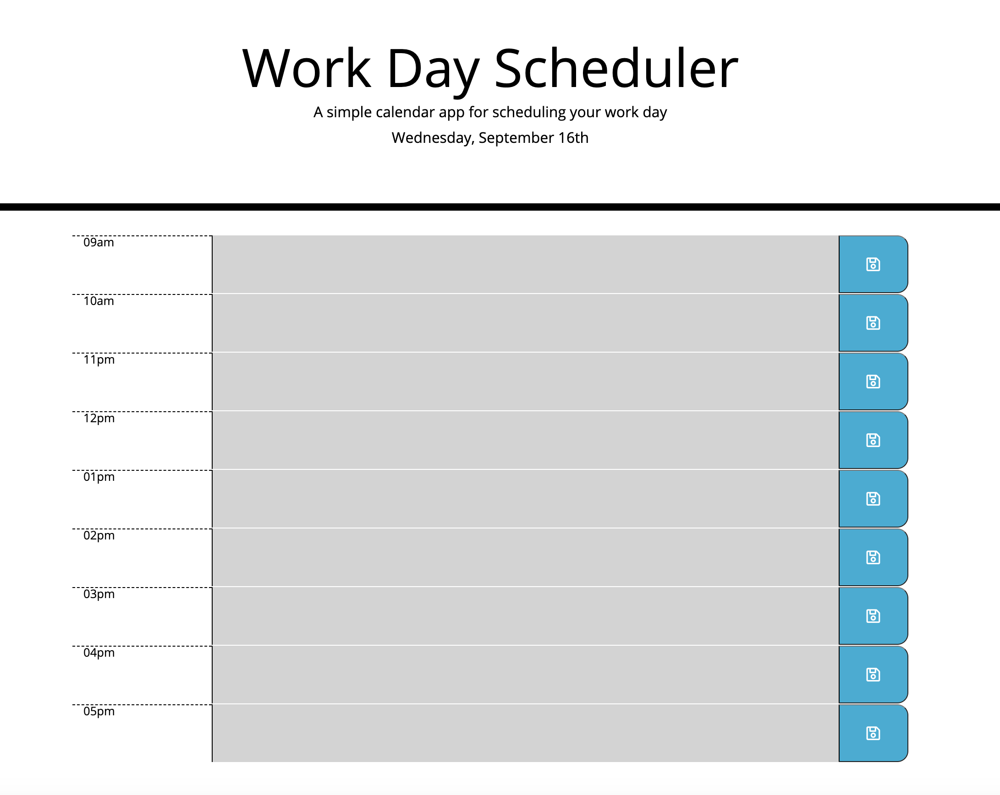
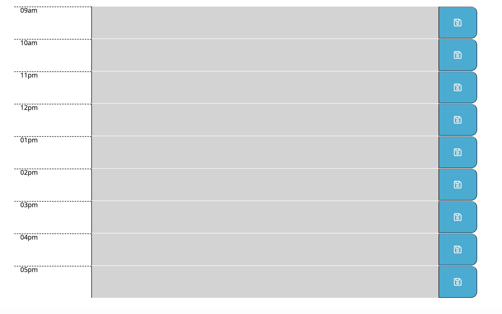
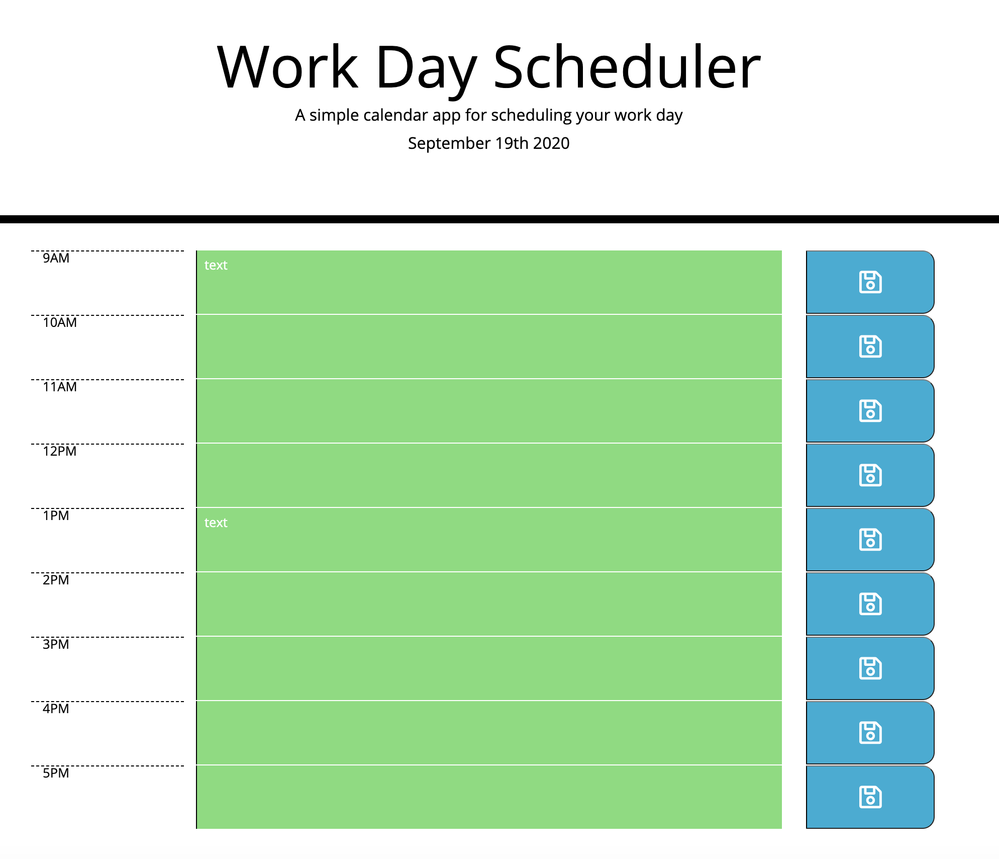

# myScheduler

https://cdflori.github.io/myScheduler/

## Overview 

Welcome to your daily schedule planner! For each day the user will be able to enter a reminder on a set hour from 9 AM to 5 PM. The user will then be able to save their reminder. If the reminder is past the current time, it will be shown in gray, for current hour reminders -- shown in red, and future reminders -- shown in green. 

## Schedule Planner

What the user will see when opening planner:

The user will see the current day at the top of the page.

The user will see the 8 hour time scheduler, input fields and save buttons.

The user will see the color of their input related to "past, present, and future" inputs. The image below is how a new day before 9 AM looks to a user.

